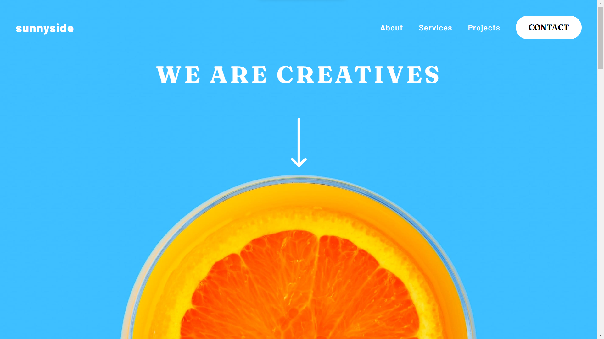
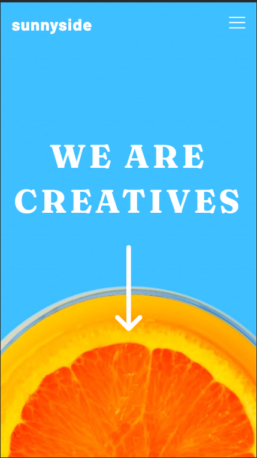

# Frontend Mentor - Sunnyside agency landing page solution

This is a solution to the [Sunnyside agency landing page challenge on Frontend Mentor](https://www.frontendmentor.io/challenges/sunnyside-agency-landing-page-7yVs3B6ef). Frontend Mentor challenges help you improve your coding skills by building realistic projects.

## Table of contents

- [Overview](#overview)
  - [The challenge](#the-challenge)
  - [Screenshot](#screenshot)
  - [Links](#links)
- [My process](#my-process)
  - [Built with](#built-with)
  - [What I learned](#what-i-learned)
  - [Continued development](#continued-development)
  - [Useful resources](#useful-resources)
- [Author](#author)
- [Acknowledgments](#acknowledgments)

## Overview

### The challenge

Users should be able to:

- View the optimal layout for the site depending on their device's screen size
- See hover states for all interactive elements on the page

### Screenshot





### Links

- Solution URL: [Add solution URL here](https://github.com/vashu-kashyap/sunnyday-frontend.io-challange)
- Live Site URL: [Add live site URL here](https://sunnyday-frontend-io-challange.vercel.app/)

## My process

### Built with

- Semantic HTML5 markup
- CSS custom properties
- Flexbox
- CSS Grid
- Mobile-first workflow
- [React](https://reactjs.org/) - JS library
- [Next.js](https://nextjs.org/) - React framework


### What I learned

During the creation of the Sunnyside Agency landing page with Next.js and Tailwind CSS, I honed my skills in responsive design. I mastered the art of incorporating multiple images for varying device sizes, ensuring an optimal user experience. Additionally, I learned to add captivating hover effects to SVG icons, enhancing interactivity. These skills transformed the static landing page into a dynamic and visually appealing interface, showcasing the agency's offerings effectively.


```css
@media (min-width: 640px) {
  .md\:bg-image-large {
    background-image: url('../public/desktop/image-graphic-design.jpg');
  }
  .md\:bg-image-large-1 {
    background-image: url('../public/desktop/image-photography.jpg');
  }
}

@media (max-width: 639px) {
  .sm\:bg-image-small {
    background-image: url('../public/mobile/image-graphic-design.jpg');
  }
  .sm\:bg-image-small-1 {
    background-image: url('../public/mobile/image-photography.jpg');
  }
}
```

```js
const proudOfThisFunc = () => {
  console.log("🎉");
};
```

## Author

- Linktree - [@vashu-kashyap](https://linktr.ee/Im.vashukashyap)
- Instagram - [@im.vashukashyap](https://www.instagram.com/im.vashukashyap/)
- Linkedin - [@im-vashukashyap](https://www.linkedin.com/in/im-vashukashyap/)


